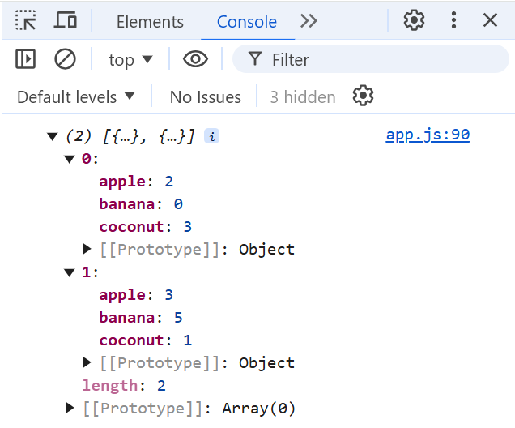

# CS272-S26 HW6: Badger Mart

In this HW, you will write functions to add, reset, checkout, and log transactions for a shopping cart!

## Important Notes

Please note that "Live Preview" will refresh your webpage each time that you save; this means that any global variables will be reset to their initial values. This is expected behavior! In a future lecture, we will discuss saving data to the browser via `sessionStorage` and `localStorage`, but for now, just beware that your global variables will reset each time you save.

You are *only* allowed to use the global variables given to you: `APPLE_COST`, `BANANA_COST`, `COCONUT_COST`, `cart`, and `transactions`. Introducing new *global* variables will cause you to lose points. You can create as many *local* variables and functions as you wish, however.

## Instructions

### 1. `addToCart`

Implement the `addToCart` function such that it first checks if the amount, retrieved from the input with `id` of `add-amount`, is a positive number. If it isn't, you should alert the user to "Please enter a positive number for an amount." Otherwise, update the corresponding number of apples, bananas, or coconuts (based on what was selected) in the cart. Finally, be sure to call `updateCart` to reflect these changes in the UI.

**Note:** This operation is *additive*, meaning that if the user adds 2 apples, then adds 3 apples, they will have a total of 5 apples in their cart.

### 2. `checkout`

Implement the `checkout` function such that it first checks if the cart is empty; if it is, alertnotify the user that "You must have something in your cart to checkout!". Otherwise, reset the cart to 0 apples, bananas, and coconuts, and `alert` the user that "Checkout complete! Thank you for your purchase.". Be sure to call `updateCart` to reflect these changes in the UI.

**Note:** In Step 4, you will be logging the list of transactions. You will need to re-visit this step to also add this `cart` to the list of `transactions`.

### 3. `resetCart`

Implement the `resetCart` function such that it resets the cart to 0 apples, bananas, and coconuts. Be sure to call `updateCart` to reflect these changes in the UI.

### 4. `logTransactions`

Implement the `logTransactions` function such that the transactions list is simply printed to the `console.log` as a `list` of `object`. See below for a screenshot after two transactions. Then, `alert` the user with "Check your console to see the list of transactions!"

**Hint:** Seeing all 0's in your transaction history, even though you are *sure* you checked out with some items? In Step 2, be sure that you are assigning cart to a new object when checking out! Otherwise, all your transactions will point towards the same cart. Re-visiting the JS5 lecture may be helpful in your understanding.
